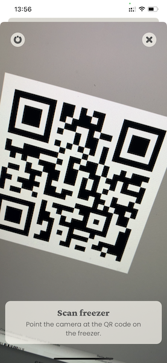

# Barcode-Scanning View for NativeScript 7

This package implements a minimalistic barcode-scanning `View` for
[NativeScript](https://nativescript.org/) (from v. 7).

* [Sample](#sample)
* [Attributes](#attributes)
* [Events](#events)
* [Dismissal](#dismissal)
* [Image Parsing](#image-parsing)
* [Barcode Formats](#barcode-formats)
* [Copyright Notice](NOTICE.md)
* [License](LICENSE.md)

## Sample




## Attributes

The `BarcodeScannerView` exposes a few attributes to control the operation of
barcode scanning:

#### XML

```xml
<BarcodeScannerView
  formats="QR_CODE, CODE_39"
  preferFrontCamera="false"
  isPaused="false"
  (scanResult)="barcodeScanned($event)"
/>
```

#### TypeScript

```typescript
import { ScanResultEventData } from '@juit/nativescript-barcodeview'

export function barcodeScanned(event: ScanResultEventData) {
  alert(`Scanned "${event.format}" barcode: ${event.text}`)
}
```

#### `formats`

The `formats` property is defined as a `KnownBarcodeFormat[]` and informs the
barcode scanner what formats should be recognized.

When specified as a `string`, the formats are case-insensitive, comma and/or
whitespace separated

See [Barcode Formats](#barcode-formats) below for a list of supported formats.

The default (empty array) represents all supported formats.

#### `isPaused`

The `isPaused` `boolean` attribute specifies whether barcode scanning is
running (`false`) or paused (`true`)paused or running.

#### `preferFrontCamera`

The `preferFrontCamera` `boolean` attribute specifies whether _preferentially_
the scanner should use the back camera (`false`) or the front one (`true`).


## Events

The `scanResult` event is triggered once a barcode has been scanned. The _event_
instance associated with this is a `ScanResultEventData` defined as follows:

```typescript
export interface ScanResultEventData extends EventData {
  /** The event name, always `scanResult` */
  eventName: ScanResultEvent,
  /** The `BarcodeScannerView` source of this event */
  object: BarcodeScannerView,
  /** The `BarcodeFormat` of the scanned barcode */
  format: BarcodeFormat;
  /** The text contained in the scanned barcode */
  text: string;
}
```

## Dismissal

Make sure that the `BarcodeScannerView`'s own `disposeNativeView()` is called
to release the camera and barcode-scanning resources


## Image Parsing

In some cases (e.g. simulators) it might be necessary to _simulate_ the scanning
of a barcode using an image stored on the device.

While this library doesn't support picking images (see the wonderful
[`@nativescript/imagepicker`](https://github.com/NativeScript/nativescript-imagepicker)
plugin for a good implementation), it offers function to scan `ImageAsset`s.

```typescript
import { parseBarcodes, BarcodeFormat } from '@juit/nativescript-barcodeview'

const ImageAsset asset = // ... get this with '@nativescript/imagepicker'

parseBarcode(asset, [ BarcodeFormat.QR_CODE ])
  .then((result: scanResult) => {
    console.log(`Scanned "${event.format}" barcode from image: ${event.text}`)
  })
```


## Barcode Formats

| Format                    | iOS     | Android |
| ------------------------- | ------- | ------- |
| [`AZTEC`][A]              |    ✓    |    ✓    |
| [`CODABAR`][B]            |    ✗    |    ✓    |
| [`CODE_128`][C]           |    ✓    |    ✓    |
| [`CODE_39`][D]            |    ✓    |    ✓    |
| [`CODE_39_MOD_43`][E]     |    ✓    |    ✗    |
| [`CODE_93`][F]            |    ✓    |    ✓    |
| [`DATA_MATRIX`][G]        |    ✓    |    ✓    |
| [`EAN_13`][H]             |    ✓    |    ✓    |
| [`EAN_8`][I]              |    ✓    |    ✓    |
| [`INTERLEAVED_2_OF_5`][J] |    ✓    |    ✗    |
| [`ITF_14`][K]             |    ✓    |    ✓    |
| [`MAXICODE`][L]           |    ✗    |    ✓    |
| [`PDF_417`][M]            |    ✓    |    ✓    |
| [`QR_CODE`][N]            |    ✓    |    ✓    |
| [`RSS_14`][O]             |    ✗    |    ✓    |
| [`RSS_EXPANDED`][P]       |    ✗    |    ✓    |
| [`UPC_A`][Q]              |    ✗    |    ✓    |
| [`UPC_E`][R]              |    ✓    |    ✓    |
| [`UPC_EAN_EXTENSION`][S]  |    ✗    |    ✓    |

[A]: https://en.wikipedia.org/wiki/Aztec_Code
[B]: https://en.wikipedia.org/wiki/Codabar
[C]: https://en.wikipedia.org/wiki/Code_128
[D]: https://en.wikipedia.org/wiki/Code_39
[E]: https://en.wikipedia.org/wiki/Code_39#Code_39_mod_43
[F]: https://en.wikipedia.org/wiki/Code_93
[G]: https://en.wikipedia.org/wiki/Data_Matrix
[H]: https://en.wikipedia.org/wiki/EAN-13
[I]: https://en.wikipedia.org/wiki/EAN-8
[J]: https://en.wikipedia.org/wiki/Interleaved_2_of_5
[K]: https://en.wikipedia.org/wiki/ITF-14
[L]: https://en.wikipedia.org/wiki/MaxiCode
[M]: https://en.wikipedia.org/wiki/PDF417
[N]: https://en.wikipedia.org/wiki/QR_code
[O]: https://en.wikipedia.org/wiki/GS1_DataBar
[P]: https://en.wikipedia.org/wiki/GS1_DataBar
[Q]: https://en.wikipedia.org/wiki/Universal_Product_Code
[R]: https://en.wikipedia.org/wiki/Universal_Product_Code#UPC-E
[S]: https://en.wikipedia.org/wiki/Universal_Product_Code
